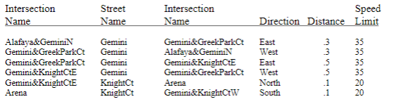

##Data Structures and Algorithms Project
This is a project that I did for my Data Structures and Algorithms class. The goal of this project was to demonstrate my understanding of the principles of the class by completing three homework assignments. The details of each homework can be seen below.
## Homework 1 Description
### Stacks, queues and the list using linked list
Write a list class to implement a doubly linked list. The list should accommodate integers and pointers. You may add other types as you need them. 

Include member functions for the following:

void 	insert_front(int data );  
void 	insert_front(void *data );  
void 	insert_rear(int data ); 
void 	insert_rear(void *data ); 
int 	remove_front_i( ); 
void * 	remove_front_p( ); 
int 	remove_rear_i( ); 
void *	remove_rear_p( ); 
int 	empty( );   

Use dynamic memory. Use the "new" instruction to allocate memory when inserting and the delete instruction to return the memory when removing. 

Make the list into a class where the actual list is private and the member functions are public. Prove your program correctness by applying several test cases. It’s up to you to decide what test cases will provide sufficient confidence your program works correctly. The output should have several test cases. Do a good job as you will use this class in the remainder of your programming assignments. 

## Homework 2 Description
### Binary search trees, AVL trees
Write a program that reads a text file and outputs a list of all words in alphabetical order. Each word should be displayed with a list of line numbers on which it occurs in the file.  Use an AVL binary search tree to store the words seen. 

Requirements:
1.	The program must work for arbitrary large files sizes. 
2.	You must test the program using the file I will provide. 
3.	Each node is to have a linked list to store all of the line numbers. Use the list you created in assignment 1. 
4.	Make the tree a class with the necessary functions. 

Example:

Input 
Hello Bill,  
Did you hear about Aunt Betty or  
about Aunt White? I cannot believe that  
… 

Output 
about		2, 3 
Aunt		2, 3 
believe		3 
Betty		2 
Bill		1 
cannot		3 
Did		    2 
hear		2 
Hello		1 
I		    2 
or		    2 
that		3 
White		3 
you		    2 
… 

## Homework 3 Description
### Graph and sorting algorithms
You are to write a program that finds the driving direction of a specified initial and end location much like MapQuest or Google Maps. You are to read the map information from a text file and create a graph. Each intersection and point of interest in the map will be given a unique name and be a vertex in the graph. Each road connecting 2 intersections is an edge in the graph. The edge names do not need to be unique. Use a directional graph since some streets may be one-ways. 
  The text file will look like: 

Steps: 
1.   Write a function to perform a Quick Sort or Merge Sort on a list of alphanumeric data.   
2.   Read the text file and add each intersection name to the list. Only read the first column since all intersection names will be in there. 
3.   Sort the list using the Quick Sort or Merge Sort algorithm 
4.   Copy the names from the sorted list into the graph. Omit duplicates. 
5.   Create the graph by reading the original map file and adding an edge for each street. Use a binary search algorithm to find the proper vertex in the graph. 
6.   In the main program ask the user to input a start and end intersection. 
7.   Find the shortest and quickest path from the start to the end intersection. The output should indicate the name of the street and the distance. 
 The output should look like: 
From Alafaya&GeminiN   
Take Gemini East to Gemini&GreekParkCt   .3 
Take Gemini East to Gemini&KnightCtE .5 
Take KnightCt North to Arena .1 